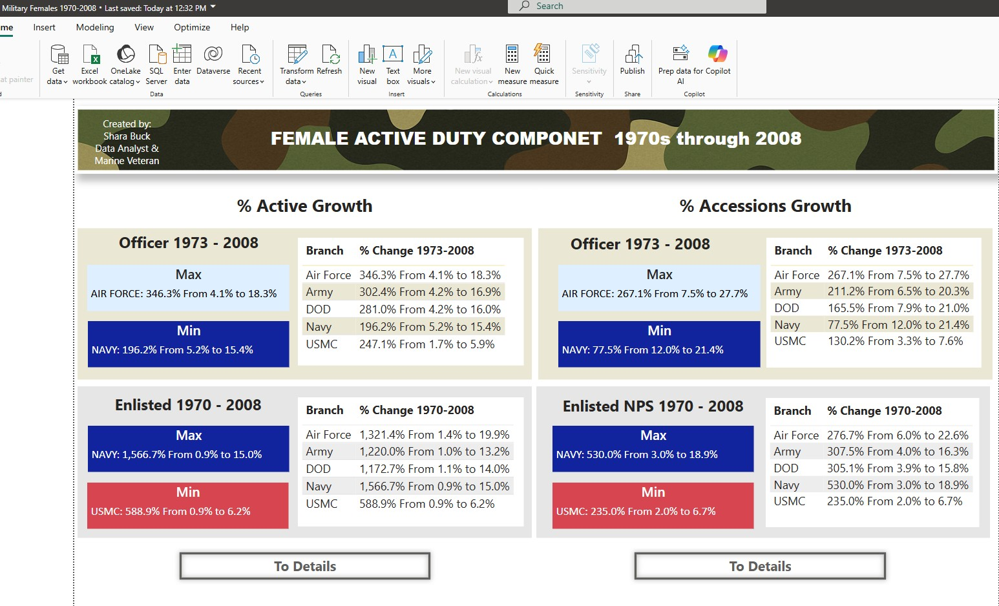

# Women in the U.S. Military: Key Trends (1976–2008)

This project explores changes in the representation of women in U.S. military branches from 1976 to 2008, focusing on enlisted and officer roles. It highlights key growth areas and visualizes long-term trends using official DoD data.

## Overview

-  **Toolset**: Python, Excel, Power BI  
-  **Data Source**: [DoD Population Representation in the Military Services – Appendix D (2008)](https://prhome.defense.gov/Portals/52/Documents/MRA_Docs/MPP/AP/poprep/2008/appendixd.pdf)  
-  **Focus**: Enlisted & Officer growth trends by branch  
-  **Key Insight**: Branches with highest and lowest growth in female participation over time

##  Process

1. **Downloaded Source PDF**
2. **Extracted Tables** from the PDF using Python (`tabula-py`)
3. **Cleaned and Structured Data** in Excel
4. **Built Visual Dashboard** in Power BI
5. **Embedded Static Infographic** to contextualize historical milestones

##  Dashboard

> ## Download Project Files

-  [Download Power BI Report (.pbix)](https://github.com/Sharabuck/military-trends/raw/master/Military%20Females%201970-2008.pbix)
-  [Download Summary PDF](https://github.com/Sharabuck/military-trends/raw/master/Military_Females_1970-2008.pdf)

> 💡 **To view the interactive dashboard:**  
> You must download the `.pbix` file above and open it using **Power BI Desktop** (free).  
> Interactive sharing via web is only available to users with a Power BI Pro or Fabric (business) account.

##  Files

- `military_trends_v1.pbix` – Full Power BI file (data + visuals)
- `scripts/extract_tables_from_pdf.py` – Python script used for table extraction
- `data/cleaned_data.xlsx` – Final structured data
- `visuals/` – Screenshots and infographics

## Attribution

Created by **Shara Buck**  
Powered by **Squirreltec.com**  
All data is publicly available and sourced from the U.S. Department of Defense.
